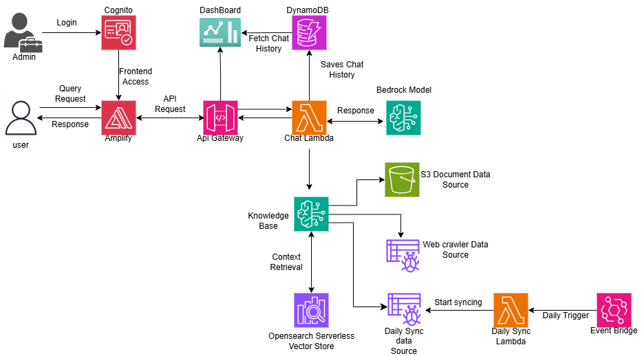

# America's Blood Centers AI Chatbot

An intelligent chatbot powered by Amazon Bedrock that provides comprehensive information about blood donation, eligibility criteria, donation centers, and real-time blood supply status. Built specifically for America's Blood Centers to help educate the public and connect potential donors with local blood centers.

## About the Chatbot

This AI-powered chatbot serves as a 24/7 virtual assistant for blood donation information, offering:

- **Instant Answers**: Get immediate responses to questions about blood donation eligibility, process, and safety
- **Bilingual Support**: Full functionality in both English and Spanish to serve diverse communities
- **Real-time Data**: Daily updates on blood supply status and current news from America's Blood Centers
- **Smart Routing**: Automatically connects users to local blood donation centers

## Repository Structure

```
Americas-Blood-Centers-chatbot-Public/
├── Backend/                    # AWS CDK infrastructure and Lambda functions
│   ├── bin/                   # CDK app entry point
│   ├── lib/                   # CDK stack definitions
│   ├── lambda/                # Lambda function code
│   ├── data-sources/          # Knowledge base data sources
│   └── deploy.sh              # One-command deployment script
├── Frontend/                   # React web application
│   ├── src/                   # React components and logic
│   ├── public/                # Static assets
│   └── package.json           # Frontend dependencies
└── docs/                      # Documentation and diagrams
```

## Architecture



**Key Components:**

**AI & Machine Learning:**
- **Amazon Bedrock Knowledge Base**: Vector database for semantic search and retrieval
- **OpenSearch Serverless**: Vector collection for storing document embeddings
- **Bedrock Model**: Bedrock LLM model for natural language conversations
- **Amazon Titan Text Embeddings v1**: Model for generating vector embeddings
- **Bedrock Data Automation**: Advanced PDF parsing with multimodal support

**Data Storage:**
- **S3 Buckets**: 
  - Documents bucket for PDF storage
  - Supplemental bucket for multimodal content (images from documents)
  - Builds bucket for frontend deployment artifacts
- **DynamoDB**: Chat history table with GSI for session and date queries

**Compute & API:**
- **AWS Lambda Functions**:
  - Chat Lambda: Main conversation handler
  - Sync Operations Lambda: Data source synchronization
  - Daily Sync Lambda: Automated daily updates
- **API Gateway**: RESTful API with CORS support and throttling
- **Step Functions**: Sequential sync workflow orchestration

**Data Sources:**
- **S3 Data Source**: PDF documents with semantic chunking
- **Web Crawler Data Source**: Live website content from americasblood.org
- **Daily Sync Data Source**: Frequently updated pages (blood supply status)

**Frontend & Authentication:**
- **AWS Amplify**: React application hosting and CI/CD
- **Amazon Cognito**: User pool for admin authentication

**Automation & Monitoring:**
- **EventBridge**: Daily sync scheduling (2 PM EST)
- **IAM Roles**: Fine-grained permissions for all services
- **CloudWatch**: Logging and monitoring (implicit)

## Features

**Backend:**
- Serverless architecture using AWS CDK
- OpenSearch Serverless for vector search
- Automated data ingestion and daily sync
- RESTful API with CORS support

**Frontend:**
- Responsive React application
- Real-time chat interface with markdown support
- Language toggle (English/Spanish)
- Material-UI components for modern design
- Mobile-optimized user experience

## Quick Start

### Prerequisites
- AWS Account with Bedrock model access enabled
- AWS CLI configured with appropriate permissions

### Deployment

1. **Clone the repository:**
```bash
git clone https://github.com/your-org/Americas-Blood-Centers-chatbot.git
cd Americas-Blood-Centers-chatbot/Backend
```

2. **Run the deployment script:**
```bash
chmod +x deploy.sh
./deploy.sh
```

3. **Follow the interactive prompts** to configure your deployment settings.

The script automatically handles:
- Infrastructure deployment via CDK
- Frontend build and deployment to Amplify
- Data source configuration and ingestion
- Daily sync automation setup

## Data Sources

The chatbot uses two primary data sources:

**PDF Documents (S3):**
- Blood donation statistics and reports
- Eligibility guidelines and medical criteria
- Safety protocols and educational materials

**Live Website Content (Web Crawler):**
- Current blood supply status from americasblood.org
- Donation center locations and information
- Latest news and announcements

**Daily Updates:** Content is automatically refreshed every day at 2 AM UTC to ensure information accuracy.

## License

This project is licensed under the MIT License.